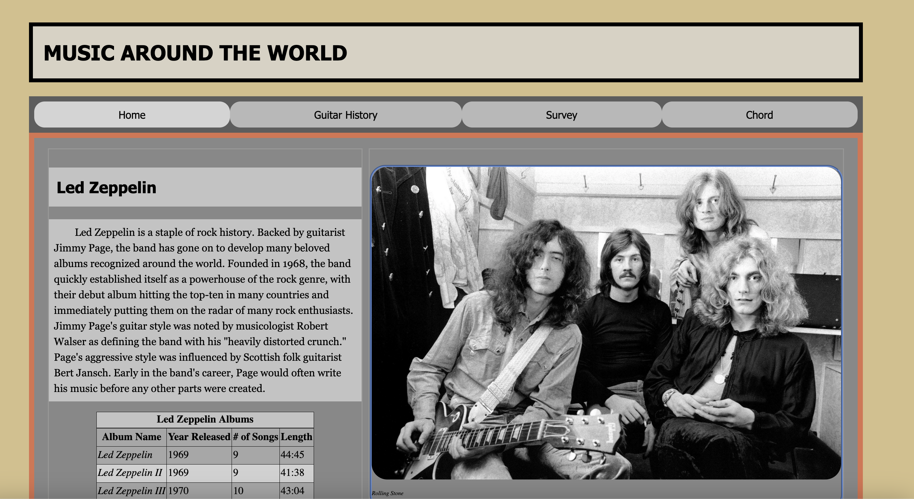

# cs008-web-design-final
# Music Around the World Website

## Description

This website provides information about music, focusing on the guitar. It covers the history of the guitar, different types of guitars, and features sections on famous bands like Led Zeppelin, Foo Fighters, and Fleetwood Mac. Users can also fill out a survey to share their favorite music genres and instrument preferences.

## Files and Directories

- `/final/detail.php`: This page provides a detailed history of the guitar, including images for comparison.
- `/final/footer.php`: Contains the footer section with site map links and credits.
- `/final/form.php`: Presents a form for users to input their contact information, favorite genres, and instrument preference.
- `/final/index.php`: The main page of the website featuring sections on Led Zeppelin, Foo Fighters, and Fleetwood Mac.
- `/final/mp3`: Directory containing MP3 audio files for different musical keys.
- `/final/mp4`: Directory containing a presentation video in MP4 format.
- `/final/nav.php`: Navigation bar for easy navigation between pages.
- `/final/sql.php`: Provides SQL code for creating and populating tables related to the website's content.
- `/final/top.php`: Contains the header, opening HTML tags, and links to CSS files.
- `/final/css/`: Directory for storing custom CSS files.
- `/final/images/`: Directory for images used on the website.

## Usage

1. Clone or download the repository.
2. Set up a local server environment (e.g., XAMPP, WAMP).
3. Place the files in the root directory of your local server.
4. Import the provided SQL file to set up the database.
5. Access the website by navigating to `http://localhost/final/index.php` in your web browser.

## Requirements

- PHP
- MySQL Database
- Web server environment (e.g., Apache)

## Additional Notes

- Ensure that your server environment supports PHP for proper functionality.
- For detailed information on each section, refer to the comments within the PHP files.

## Contributors

- Nolan Cyr
- Matt Swaim

## License

This project is licensed under the [MIT License](LICENSE).

## Contact

For any inquiries or issues, please contact [Nolan Cyr](mailto:nolangcyr@gmail.com) or [Matt Swaim](mailto:matthew.swaim@uvm.edu>).
